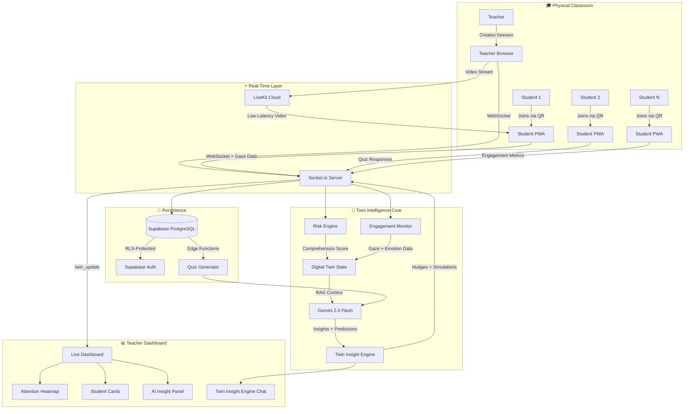

<p align="center">
  <strong>🏆 SYNTHVERSE 2026 — HACKATHON SUBMISSION</strong>
</p>

<h1 align="center">ClassTwin — The AI Digital Twin for Your Classroom</h1>

<p align="center">
  <em>Track: AI & Intelligent Digital Twins</em><br/>
  <strong>A real-time, AI-powered Digital Twin that mirrors every heartbeat of a live classroom.</strong>
</p>

<p align="center">
  
  
  
</p>

---

## 🧠 The Problem — Classrooms Are Flying Blind

> A teacher stands before 40 students. _Who truly understands?_ Who is silently falling behind? Who is on the verge of giving up? Today, teachers find out **after** the exam — when it's too late.

Traditional classrooms suffer from:

| Pain Point | Impact |
|---|---|
| **No real-time visibility** into comprehension | Teachers rely on gut feeling, not data |
| **Delayed feedback loops** | Struggling students are identified _weeks_ too late |
| **One-size-fits-all pacing** | High achievers get bored; at-risk students fall through the cracks |
| **Zero predictive capability** | No way to simulate "what if I change my teaching strategy right now?" |

**The result:** A teacher's best intention meets an opaque wall of 40 faces.

---

## 💡 The Solution — ClassTwin

**ClassTwin** is a **real-time AI Digital Twin of a live classroom** — a system that constructs and continuously updates a high-fidelity virtual replica of every student's cognitive state, enabling teachers to move from _reactive teaching_ to **proactive orchestration**.

> **"If a pilot has a cockpit, why doesn't a teacher?"**

### What Makes It a Digital Twin?

| Digital Twin Property | ClassTwin Implementation |
|---|---|
| 🪞 **Real-time Mirroring** | Webcam-based gaze tracking (MediaPipe) + live quiz responses continuously update each student's "cognitive state" in the twin |
| 📊 **State Representation** | Comprehension scores, engagement levels, risk tiers, emotion detection, gaze heatmaps — all modeled per-student |
| 🔄 **Bi-directional Sync** | Teacher actions (nudges, quizzes, topic changes) flow from the digital twin back to physical students via WebSocket + LiveKit |
| 🤖 **AI-Powered Intelligence** | Gemini 2.0 Flash + RAG pipeline continuously analyze twin state and provide predictive simulations |
| 🎯 **Predictive Modeling** | "What-if" simulation engine predicts impact of interventions (_e.g., "If I give a break, focus will rise by 15%"_) |

---

## 🏗️ Architecture — How ClassTwin Works



---

## 🔥 Key Features — What Judges Will See

### 1. 📡 Live Classroom Session with QR Join

Teachers create a session with a topic → a **QR code** is instantly generated → students scan and join from any device. No app install required.

- **Session Management** with unique join codes
- **Real-time student roster** that updates as students join
- QR code auto-generated with student PWA deep link

### 2. 🧠 Comprehension Heatmap & Risk Engine

Every student's cognitive state is modeled in real-time using a custom **Risk Engine** with three tiers:

| Risk Level | Criteria | Visual |
|---|---|---|
| 🟢 `ON_TRACK` | Accuracy + speed + improving trend | Green indicator |
| 🟡 `AT_RISK` | Below class average OR skipped questions | Amber warning |
| 🔴 `HIGH_RISK` | Declining trend + significantly below average | Red critical alert |

**Comprehension Score Formula:**
```
Score = (Streak Accuracy × 50%) + (Response Speed × 30%) + (Trend Bonus × 20%)
```

The Risk Engine runs **after every answer** — the teacher sees the class evolve in real-time.

### 3. 👁️ Webcam-Based Gaze Tracking & Attention Heatmap

Using **MediaPipe FaceLandmarker (478 landmarks)**, we perform:

- **Iris position extraction** from both eyes (landmarks 468–477)
- **Head pose compensation** (nose tip, forehead, chin vectors)
- **Gaze vector normalization** — mapping gaze to screen coordinates
- **Real-time aggregation** via WebSocket to teacher dashboard

The **Attention Heatmap** canvas renders:
- 🔥 **Hottest Zone** — where students look most
- 👻 **Dead Zone** — content areas nobody is reading
- 📊 **Focus Score** — real-time collective attention metric

_Sent at 2Hz (every 500ms) per student._

### 4. 🤖 Twin Insight Engine — The Cognitive Orchestrator

Not a generic chatbot. A **RAG-powered AI co-pilot** that has real-time access to the classroom's Digital Twin state.

| Capability | How It Works |
|---|---|
| **RAG Context** | Fetches live telemetry — engagement logs, gaze data, emotion distributions, risk tiers — and injects it into Gemini's context window |
| **Predictive Simulation** | "What if I give a break?" → Engine simulates focus/pass-rate deltas with confidence scores |
| **Nudge Execution** | "The back row is distracted" → AI identifies low-attention students → sends focus-nudge via WebSocket |
| **Data-Grounded Responses** | Every response references specific students, data points, and metrics |

**Example Interaction:**
> **Teacher:** "What's the current confusion hotspot?"  
> **Twin Engine:** "Based on 142 data points, collective focus is at 68%. **Rahul** (32% confidence) and **Priya** (41% confidence) show confusion. I recommend a brief interactive check-in on _Recursion Base Case_."

### 5. 📝 AI-Generated Quizzes via Supabase Edge Functions

- Teachers enter a topic → **Gemini generates MCQ questions** via a Supabase Edge Function
- Questions are persisted to PostgreSQL and **pushed to student devices via WebSocket** in real-time
- After students answer → **live results stream back** to the teacher dashboard with per-question analytics

### 6. 🎥 LiveKit Video Streaming

- Teacher publishes live video → **Low-latency WebRTC** via LiveKit Cloud
- Students receive the stream as viewers (subscribe-only access)
- PiP (Picture-in-Picture) preview on the teacher dashboard
- Room management: create, join, end — all automated

### 7. 📈 Post-Session Analytics & Student Profiles

- **Session Library**: Chronological session history with engagement heatmap bars
- **Oracle Insight**: Gemini-powered cross-session performance summary with "Cognitive Sync" score
- **Student Detail Pages**: Deep-dive per student — confidence over time, emotion distribution, gaze metrics, session history, head pose analysis

---

## 🛠️ Tech Stack — Why Each Choice Matters

| Layer | Technology | Why |
|---|---|---|
| **Frontend** | React 19 + Vite 8 | Blazing-fast HMR; concurrent features for real-time UI |
| **Styling** | CSS Variables + Glassmorphism | Dark/light theme-ready; premium "liquid glass" aesthetic |
| **Backend** | Node.js + Express + Socket.io | Event-driven; handles 200+ concurrent WebSocket connections |
| **Database** | Supabase PostgreSQL | Row-Level Security, real-time subscriptions, Edge Functions |
| **Auth** | Supabase Auth (Google OAuth) | Zero friction sign-in for teachers |
| **AI** | Google Gemini 2.0 Flash | Low-latency generation for real-time classroom context |
| **Vision** | MediaPipe FaceLandmarker | Client-side GPU-accelerated; 478 facial landmarks; <50ms inference |
| **Video** | LiveKit Cloud (WebRTC) | Sub-second latency; scales to 200 participants per room |
| **Quiz Engine** | Supabase Edge Functions | Serverless Gemini calls, auto-scales, zero cold-start on Deno |
| **Charting** | Recharts 3.x | Composable React charting for analytics dashboards |
| **QR Generation** | qrcode.react + node-qrcode | Student join flow requires zero setup from students |

---

## 📁 Project Structure

```
ClassTwin/
├── backend/                    # Node.js + Express + Socket.io server
│   ├── server.js               # 1,159 lines — REST API + WebSocket + LiveKit + Quiz
│   ├── twinChatService.js      # RAG context, simulation engine, nudge system
│   ├── riskEngine.js           # Comprehension scoring + failure prediction
│   ├── aiService.js            # Gemini/Claude integration for AI insights
│   ├── livekitService.js       # WebRTC token generation + room management
│   ├── sessionManager.js       # In-memory session, QR, round management
│   └── supabaseClient.js       # RLS-aware Supabase client factory
│
├── frontend/                   # React 19 + Vite SPA
│   └── src/
│       ├── pages/
│       │   ├── LandingPage.jsx         # Marketing-grade landing page
│       │   ├── SessionLibrary.jsx      # Session history with heatmap bars
│       │   ├── SessionLobby.jsx        # QR code + quiz + live stream control
│       │   ├── LiveDashboard.jsx       # Glassmorphic live monitoring UI
│       │   ├── AITutor.jsx             # Twin Insight Engine (RAG chat)
│       │   ├── PostSessionAnalytics.jsx # Cross-session analytics
│       │   ├── StudentsPage.jsx        # Student roster with risk indicators
│       │   └── StudentDetailPage.jsx   # Deep-dive per-student analytics
│       ├── components/
│       │   ├── AttentionHeatmap.jsx     # Canvas-rendered gaze heatmap
│       │   ├── GazeTracker.jsx         # MediaPipe iris tracking + gaze estimation
│       │   ├── LiveVideoRoom.jsx       # LiveKit video player
│       │   └── Sidebar.jsx             # Navigation sidebar
│       ├── hooks/
│       │   ├── useSocket.js            # Socket.io connection hook
│       │   └── useLiveKit.js           # LiveKit token + stream hook
│       └── contexts/
│           └── AuthContext.jsx         # Supabase auth state provider
│
└── shared/
    └── constants.js            # Shared configuration
```

---

## 🎯 How ClassTwin Maps to the Judging Criteria

### 🏆 Innovation (30%)

| Claim | Evidence |
|---|---|
| First **classroom-specific** Digital Twin with webcam gaze tracking | MediaPipe iris tracking → real-time attention heatmap per student |
| AI that doesn't just answer questions — it **orchestrates the classroom** | RAG pipeline feeds live telemetry into Gemini; predictive simulation engine; nudge system |
| "What-if" **counterfactual simulation** for teaching decisions | "If I give a break" → quantified focus delta with confidence score |
| Bi-directional digital twin — not just monitoring, but **actuation** | Teacher triggers nudge → WebSocket pushes focus-prompt to specific students |

### ⚙️ Functionality (25%)

| Feature | Status |
|---|---|
| Session creation + QR join flow | ✅ Fully working |
| Real-time quiz with live answer streaming | ✅ Fully working |
| AI-generated questions (Gemini via Edge Function) | ✅ Fully working |
| Live video streaming (LiveKit WebRTC) | ✅ Fully working |
| Webcam gaze tracking (MediaPipe) | ✅ Fully working |
| Attention heatmap rendering | ✅ Fully working |
| Risk engine with 3-tier classification | ✅ Fully working |
| Twin Insight Engine (RAG + Gemini chat) | ✅ Fully working |
| Predictive simulation ("what-if") | ✅ Fully working |
| Nudge system | ✅ Fully working |
| Post-session analytics | ✅ Fully working |
| Student detail profiles | ✅ Fully working |
| Google OAuth authentication | ✅ Fully working |

### 🔧 Technical Implementation (25%)

| Aspect | Detail |
|---|---|
| **Lines of Code** | ~4,500+ lines of production code (backend + frontend) |
| **Real-time Architecture** | WebSocket + LiveKit dual real-time layer |
| **AI Integration Depth** | RAG pipeline + predictive simulation + nudge execution = 3 distinct AI modalities |
| **Computer Vision** | Client-side GPU-accelerated MediaPipe with iris landmark extraction |
| **Database Design** | RLS-protected PostgreSQL with sessions, students, engagement logs, questions, responses |
| **Security** | JWT-based auth middleware, Row-Level Security on all tables, per-user Supabase clients |

### 📈 Feasibility (20%)

| Factor | Reality |
|---|---|
| **Deployable today** | Supabase + Vercel + LiveKit Cloud = fully hosted, zero ops |
| **Cost-effective** | MediaPipe runs on-device (zero API cost for vision); Gemini Flash is the cheapest LLM per token |
| **Scalable** | Socket.io handles 200+ concurrent; LiveKit handles 200 per room; Supabase auto-scales |
| **Privacy-respecting** | Gaze data processed client-side; only aggregated coordinates are transmitted |
| **Real classroom need** | Validated pain point — teachers have no real-time comprehension visibility |

---

## 🚀 Live Demo Flow (Recommended for Judges)

1. **Open the Landing Page** → See the marketing-grade hero
2. **Google Sign In** → Instant auth
3. **Create a Session** → Topic: "Recursion in Python"
4. **Scan QR on a phone** → Student joins instantly
5. **Generate AI Quiz** → 5 questions appear on student devices
6. **Watch the Risk Engine** → Comprehension scores update live
7. **Open the Attention Heatmap** → See gaze hotspots
8. **Ask the Twin Insight Engine** → "Who's struggling right now?"
9. **Run a Simulation** → "If I give a 10-min break?"
10. **Send a Nudge** → Focus-alert delivered to distracted students
11. **End Session** → Review post-session analytics

---

## 👥 Team

| Role | Contribution |
|---|---|
| **Full-Stack + AI Architecture** | System design, RAG pipeline, risk engine, twin chat service, all backend logic |
| **Frontend + Vision** | React dashboard, MediaPipe gaze tracking, attention heatmap, UI/UX design |
| **Integration + DevOps** | Supabase schema, LiveKit, Edge Functions, authentication flow |

---

## 🌟 One-Line Pitch

> **ClassTwin turns every classroom into a living, breathing digital twin — where AI doesn't replace the teacher, it gives them superhuman awareness of every student's mind.**

---

<p align="center">
  <strong>Built with ❤️ in 24 hours at SYNTHVERSE 2026</strong><br/>
  <em>BMSCE IEEE Computer Society × IEEE CS Bangalore Chapter</em>
</p>
